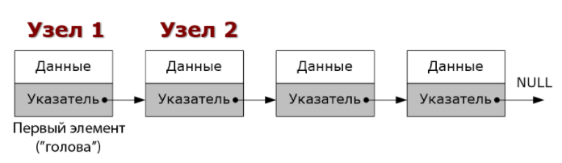

## Задача 4. Односвязный список
### Что нужно сделать
Мы продолжаем тему структур данных и алгоритмов. И в этот раз вам нужно реализовать односвязный список.

Связный список — это структура данных, которая состоит из элементов, называющихся узлами. В узлах хранятся данные, а между собой узлы соединены связями. Связь — это ссылка на следующий или предыдущий элемент списка.



В односвязном списке связь — это ссылка только на следующий элемент, то есть в нём можно передвигаться только в сторону конца списка. Узнать адрес предыдущего элемента, опираясь на содержимое текущего узла, невозможно.

Реализуйте такую структуру данных без использования стандартных структур Python (list, dict, tuple и прочие) и дополнительных модулей. Для структуры реализуйте следующие методы:

- append — добавление элемента в конец списка;
- get — получение элемента по индексу;
- remove — удаление элемента по индексу.

Дополнительно: сделайте так, чтобы по списку можно было итерироваться с помощью цикла.

Пример основной программы:

```python
my_list = LinkedList()
my_list.append(10)
my_list.append(20)
my_list.append(30)
print('Текущий список:', my_list)
print('Получение третьего элемента:', my_list.get(2))
print('Удаление второго элемента.')
my_list.remove(1)
print('Новый список:', my_list)
```

Результат:
```
Текущий список: [10 20 30]
Получение третьего элемента: 30
Удаление второго элемента.
Новый список: [10 30]
```
### Что оценивается
- Результат вычислений корректен.
- Модели реализованы в стиле ООП, основной функционал описан в методах классов и в отдельных функциях.
- При написании классов соблюдаются основные принципы ООП: инкапсуляция, наследование и полиморфизм.
  - Для получения и установки значений у приватных атрибутов используются сеттеры и геттеры.
  - Для создания нового класса на основе уже существующего используется наследование.
- Формат вывода соответствует примеру.
- Переменные, функции и собственные методы классов имеют значащие имена (не `a`, `b`, `c`, `d`).
- Классы и методы/функции имеют прописанную документацию.
- Есть аннотация типов для методов/функций и их аргументов (кроме `args` и `kwargs`). Если функция/метод ничего не возвращает, то используется `None`.
